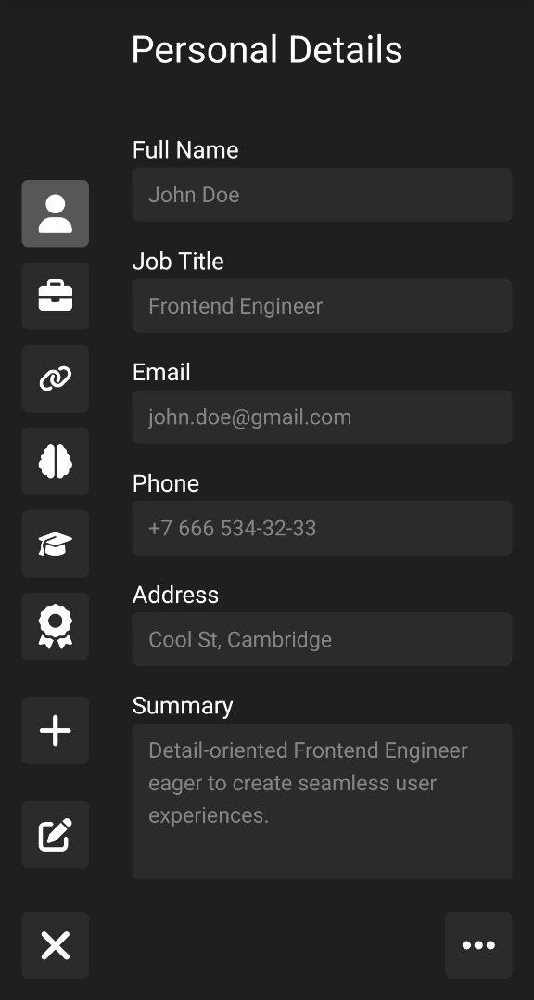
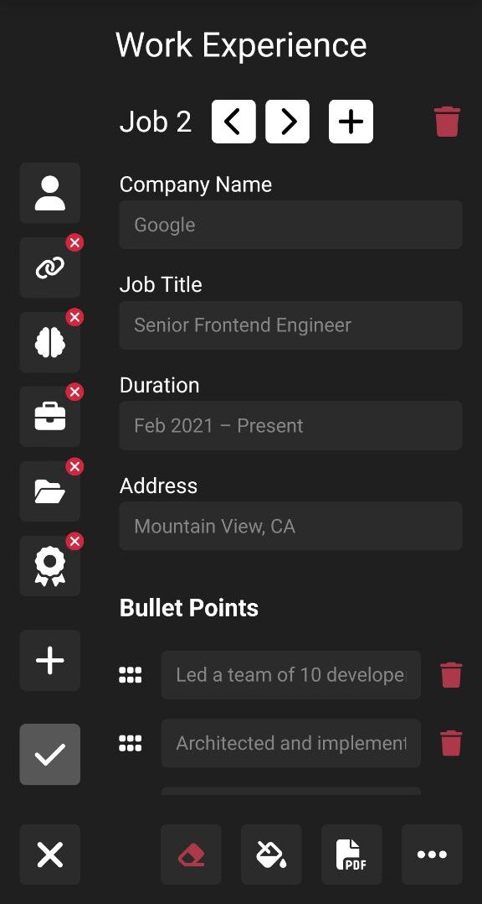
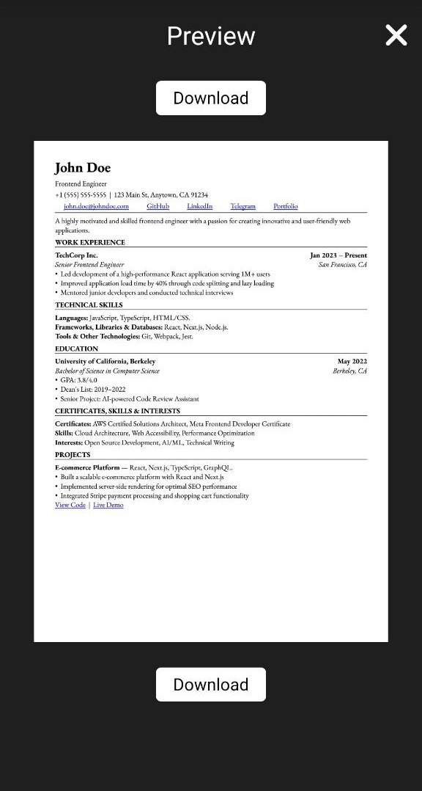

## Mobile Experience

> Since the desktop version is currently WIP, here is a preview of the mobile-first workflow.

|                                         **1. Clean Editor**                                          |                                      **2. Intuitive UI**                                      |                                       **3. Professional Output**                                       |
| :--------------------------------------------------------------------------------------------------: | :-------------------------------------------------------------------------------------------: | :----------------------------------------------------------------------------------------------------: |
|  |  |  |

# Resume Constructor

A TypeScript application designed to create software-engineering resumes based on principles from the book _The Tech Resume Inside Out_.

**[Open Live Demo](https://resume-constructor.vercel.app)**
_(Please view on a mobile device or use DevTools Device Mode, as the desktop version is currently WIP)_

This is the **capstone project** for The Odin Project (frontend curriculum), demonstrating a **production-grade development workflow** without relying on bootstrapping tools like Create React App.

---

### Key Engineering Highlights

- **Architecture:** Strict separation of concerns (UI Kit vs. Business Logic) combined with component colocation (tests, styles and logic kept together) for high maintainability.
- **Build System:** **Custom webpack 5 configuration** (manual setup). Correctly configured with **multi-entry points** and specific **Terser settings** (as per PDF.js documentation) to ensure the PDF worker runs in a background thread without breaking in production builds.
- **Type Safety:** 100% strictly typed **TypeScript** codebase.
- **Testing Strategy:** Comprehensive coverage (8,500+ lines of tests, > 60% of the codebase size), TDD, Testing Pyramid.
  - **Unit/Integration (Jest):** Covers UI components and custom hooks isolated logic.
  - **E2E (Playwright):** Covers critical user flows and export functionality.
- **Inclusive Design (A11y):** Built with a strict **“accessibility-first”** mindset. All features, including complex interactions like drag & drop, are fully keyboard-navigable and compatible with screen readers (tested with Orca).
- **Rich Interactive Experience:** Implemented a fully accessible Drag & Drop interface using `dnd-kit` for intuitive reordering of resume sections and list items. The feature includes:
  - **Intuitive Visual Feedback:** Custom animations (iOS-style “jiggling” icons in edit mode) to clearly communicate component states.
  - **Full Keyboard Support:** All DnD operations can be performed using only the keyboard (Tab, Space, Arrow Keys).
  - **Screen Reader Compatibility:** Thoroughly tested with screen readers to ensure all actions and state changes are announced correctly.
- **Pragmatic Rendering Strategy:** Conducted a deep dive into React-PDF and PDF.js internals to render PDF as an embedded document without a toolbar in Firefox. After identifying critical constraints within PDF.js, I made a strategic decision to pivot to a Canvas-based rendering solution for the preview/download screen. This ensured 100% cross-browser consistency without over-engineering.

---

### Project Structure & Organisation

The codebase follows **Component Colocation** and **Barrel Export** patterns to ensure scalability.

```text
src/
├── components/                # Shared UI Kit (buttons, popups, toolbar)
│   └── Button/                # Colocation: Logic, styles, tests and types in one place
│       ├── Button.tsx
│       ├── Button.scss        # BEM styling
│       ├── Button.test.tsx
│       └── index.tsx          # Barrel export
├── pages/                     # Feature views (Education, Experience, Skills forms)
├── hooks/                     # Isolated business logic (custom hooks)
│   ├── useResumeData/         # Complex state management logic
│   └── useResumeData.test.ts  # Logic-only testing
├── styles/                    # SCSS architecture (7-1 pattern adaptation)
│   ├── base/                  # Typography, resets
│   ├── utils/                 # Variables, mixins, functions
│   └── blocks/                # BEM blocks used by many different components
└── types/                     # Shared TypeScript interfaces
```

### Tech Stack & Methodology

- **Core:** React 19, TypeScript.
- **Styling:** SCSS + BEM.
  - _Why?_ Chosen over utility-first frameworks (Tailwind) to maintain strict control over the cascade, isolate component styles and ensure precise print layouts.
- **State Management:** Custom hooks.
- **Quality Control:**
  - **ESLint Evolution:** Originally implemented with Airbnb’s JavaScript Style Guide, then migrated to a custom **flat config** setup tailored specifically for the TypeScript transition.
  - **Code Hygiene:** Leverages `eslint-plugin-perfectionist` with **custom import groups** that mirror the project’s folder structure (Components, Hooks, Pages, Utils), reducing cognitive load.
  - **React Best Practices:** Integrates `eslint-plugin-react-you-might-not-need-an-effect` to prevent anti-patterns and encourage derived state over redundant effects.
  - **Accessibility Linting:** `eslint-plugin-jsx-a11y` with strict settings to catch non-semantic markup or missing ARIA labels during development.
  - **Stylelint:** Configured with `stylelint-config-sass-guidelines` for best practices and `concentric-order` for consistent property sorting. Explicitly enforces a **strict nesting limit (max-depth: 3)** to prevent high specificity issues and maintain readable stylesheets.
  - **Prettier:** Ensures consistent formatting across all file types.
  - **Husky & lint-staged:** Pre-commit hooks that prevent unformatted or broken code from entering the repository.

### Project Status: MVP

The core engine is complete and **mobile-optimised**.
Currently working on:

- [ ] **Persistence:** Saving drafts via LocalStorage.
- [ ] **Medium/Large UI:** Optimising the UI for medium- and large-sized screens.

### Setup & Development

*If you haven’t got Bun, you can use npm. The only script that won’t work is `e2e` because `playwright.config.ts` specifies a Shell script that uses Bun for starting a local server.*

```Bash
# Clone the repository
git clone https://github.com/fiftythanks/resume-constructor.git

# Install dependencies
bun install

# Run development server
bun start

# Run unit and integration tests (8.5k+ lines coverage)
bun run test

# Run E2E tests
bun run e2e
```
