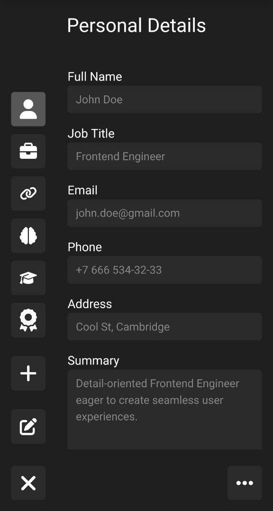
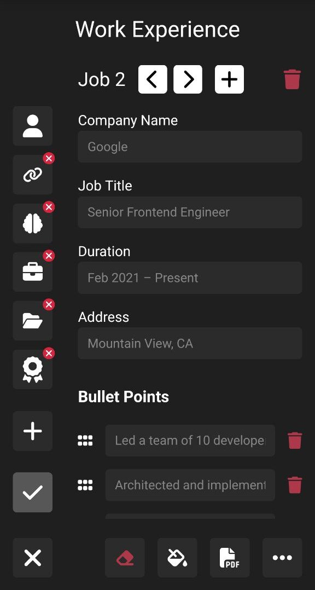
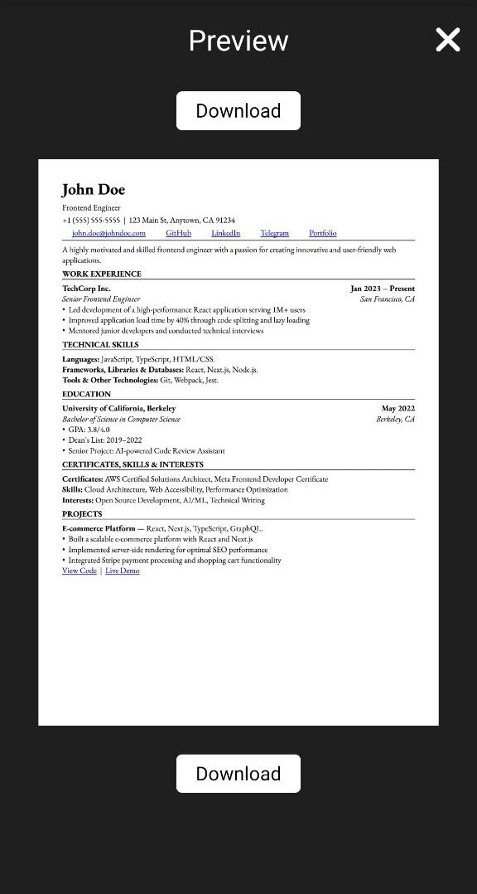

## Mobile Experience

> Since the desktop version is currently WIP, here is a preview of the mobile-first workflow.

|                                         **1. Clean Editor**                                          |                                      **2. Intuitive UI**                                      |                                       **3. Professional Output**                                       |
| :--------------------------------------------------------------------------------------------------: | :-------------------------------------------------------------------------------------------: | :----------------------------------------------------------------------------------------------------: |
|  |  |  |

# Resume Constructor

A TypeScript application designed to create software-engineering resumes based on principles from the book _The Tech Resume Inside Out_.

**[Open Live Demo](https://resume-constructor.vercel.app)**
_(Please view on a mobile device or use DevTools Device Mode, as the desktop version is currently WIP)_

This is the **capstone project** for The Odin Project (frontend curriculum), demonstrating a **production-grade development workflow** without relying on bootstrapping tools like Create React App.

---

### Key Engineering Highlights

- **Architecture:** Strict separation of concerns (UI Kit vs Business Logic) combined with component colocation (tests, styles and logic kept together) for high maintainability.
- **Build System:** **Custom webpack 5 multi-entry configuration** compiling the main application and `pdf.worker` in parallel to run document processing in a background worker thread.
- **Strict Type Safety:** TypeScript application source code (`strict: true`, no implicit `any`, no unreachable code) enforcing deep immutability across component boundaries via `ReadonlyExcept` and `type-fest`'s `ReadonlyDeep`.
- **Testing Strategy:** Over 560 automated unit and integration tests (11,700+ lines of Jest and React Testing Library specs, accounting for over 60% of the codebase size), querying elements strictly by accessible roles and simulating user interactions.
  - **E2E & Automated Audits (Playwright):** Dockerised smoke and visual regression test suites verifying core user flows (data population, canvas rendering, PDF blob download) and automated `@axe-core/playwright` accessibility audits.
- **Inclusive Design (A11y):** Built targeting WCAG 2.2 AA standards. All features, including complex interactions like drag & drop, are fully keyboard-navigable with focus management via `tabbable`, dynamic announcements via `aria-live="polite"` and explicit `htmlFor` form labeling.
- **Rich Interactive Experience:** Implemented an accessible Drag & Drop interface using `@dnd-kit` for intuitive reordering of resume sections and list items:
  - **Visual Feedback:** Edit-mode shake indicator communicating draggable state.
  - **Full Keyboard Support:** Complete sensor support for keyboard reordering via Space and Arrow keys.
  - **Screen Reader Compatibility:** Dynamic announcements across live regions for item pickup, movement, drop and cancellation.
- **Document Rendering Pipeline:** Utilises `@react-pdf/renderer` to generate the document binary and `pdfjs-dist` to rasterise it onto an HTML `<canvas>` inside a native `<dialog>` modal. This bypasses inconsistent browser-embedded PDF viewer toolbars (such as Firefox) whilst ensuring 1:1 visual parity with the exported PDF. _(Work in progress: introducing a side-by-side pure JSX DOM live preview on tablet and desktop screens for real-time typing feedback while retaining the on-demand Canvas modal for final pre-download inspection)._

---

### Project Structure & Organisation

The codebase follows **Component Colocation** and **Barrel Export** patterns to ensure scalability.

```text
src/
├── components/                # Shared UI Kit (buttons, popups, toolbar)
│   └── Button/                # Colocation: Logic, styles, tests and types
│       ├── Button.tsx
│       ├── Button.scss        # BEM styling
│       ├── Button.test.tsx
│       └── index.tsx          # Barrel export
├── pages/                     # Feature views (Education, Experience, Skills)
├── hooks/                     # Isolated business logic (custom hooks)
│   ├── useResumeData/         # Complex state management logic
│   └── useResumeData.test.ts  # Logic-only testing
├── styles/                    # SCSS architecture (7-1 pattern adaptation)
│   ├── base/                  # Typography, resets
│   ├── utils/                 # Variables, mixins, functions
│   └── blocks/                # BEM blocks used by many different components
└── types/                     # Shared TypeScript interfaces
```

### Tech Stack & Methodology

- **Core:** React 19, TypeScript.
- **Styling:** SCSS + BEM.
  - _Why?_ Chosen over utility-first frameworks (Tailwind) to maintain strict control over the cascade, isolate component styles and ensure precise print layouts.
- **State Management:** Custom hooks.
- **Quality Control:**
  - **ESLint Evolution:** Originally implemented with Airbnb’s JavaScript Style Guide, then migrated to a custom **flat config** setup tailored specifically for the TypeScript transition.
  - **Code Hygiene:** Leverages `eslint-plugin-perfectionist` with **custom import groups** that mirror the project’s folder structure (Components, Hooks, Pages, Utils), reducing cognitive load.
  - **React Best Practices:** Integrates `eslint-plugin-react-you-might-not-need-an-effect` to prevent anti-patterns and encourage derived state over redundant effects.
  - **Accessibility Linting:** `eslint-plugin-jsx-a11y` with strict settings to catch non-semantic markup or missing ARIA labels during development.
  - **Stylelint:** Configured with `stylelint-config-sass-guidelines` for best practices and `concentric-order` for consistent property sorting. Explicitly enforces a **strict nesting limit (max-depth: 3)** to prevent high specificity issues and maintain readable stylesheets.
  - **Prettier:** Ensures consistent formatting across all file types.
  - **Husky & lint-staged:** Pre-commit hooks that prevent unformatted or broken code from entering the repository.

### Documentation & Roadmap

Comprehensive technical documentation, architecture deep dives and the complete TypeDoc API reference are available on our documentation portal:

- **Documentation Portal:** [docs.resume-constructor.sholokhov.dev](https://docs.resume-constructor.sholokhov.dev)
- **Detailed Roadmap & Technical Decisions:** [docs.resume-constructor.sholokhov.dev/guides/roadmap](https://docs.resume-constructor.sholokhov.dev/guides/roadmap)

#### Major Planned Milestones

1. **Responsive Multi-Screen Workspace:** Unified desktop sidebar, side-by-side editing and live preview pane for tablet and desktop viewports (`@media (min-width: 768px)`). Mobile remains a focused single-column editor with the modal pre-download preview.
2. **Pure JSX Live Preview (Tablet/Desktop):** Instant DOM preview engine providing typing feedback on wider viewports without canvas overhead while retaining the pre-download PDF inspection modal.
3. **Data Persistence & Draft Recovery:** Automatic `localStorage` synchronisation with snapshot history.
4. **Form Ergonomics & Semantic Fieldsets:** Refactoring item cards to semantic `<fieldset>` elements, skills input modernisation and consolidating contact sections.
5. **Internationalisation (i18n):** Multilingual resume support and Cyrillic font subset loading.

### Setup & Development

_Bun (v1.1+) is required. The repository uses `bun.lock` and relies on Bun runtime scripts for local development, testing and building._

```Bash
# Clone the repository
git clone https://github.com/fiftythanks/resume-constructor.git

# Install dependencies
bun install

# Run development server
bun start

# Run unit and integration tests (11.7k+ lines coverage)
bun run test

# Run E2E tests
bun run e2e
```

### Contributing

Please review [CONTRIBUTING.md](CONTRIBUTING.md) for details on our code style,
branching model, git hooks and Conventional Commits specification.
