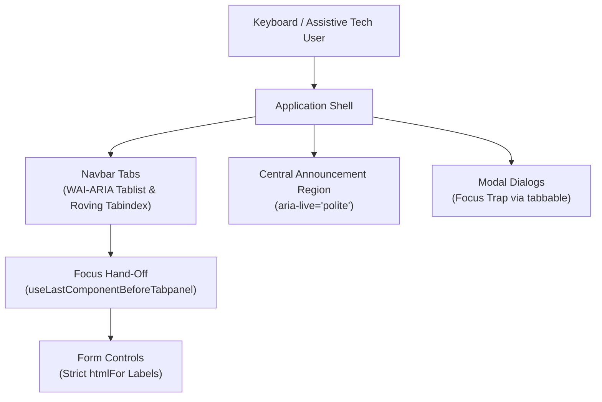

## Overview

Accessibility is treated as a core architectural constraint rather than a post-development checklist. Resume Constructor conforms strictly to the **WCAG 2.2 Level AA** standard, ensuring that every user interface element is fully operable via keyboard, announces dynamic state changes to assistive technologies and preserves focus continuity across modal and tab boundaries.

---

## 1. Keyboard Navigation & Tab Management

The primary section navigation implements the **W3C WAI-ARIA Tabs Pattern**:

- **Semantic Role Hierarchy:** The navigation container uses `<ul role="tablist" aria-orientation="vertical">`. Each individual section button implements `role="tab"`, `aria-selected={isSelected}` and `aria-controls="<sectionId>-tabpanel"`.
- **Roving Tabindex:** Only the currently active section tab receives `tabIndex={0}`. All other tabs are set to `tabIndex={-1}`.
- **Directional Traversal:**
  - `ArrowDown` and `ArrowUp` move focus sequentially between active section tabs.
  - Boundary wrapping automatically moves focus to "Add Sections" or "Edit Sections" buttons at the ends of the tab list.
  - `Delete` key on an active tab deletes the section and transfers focus to the subsequent or preceding tab button.
  - `Escape` exits editor mode and restores focus to the corresponding section tab.

---

## 2. Modal Dialog Focus Trapping (`Popup`)

The modal primitive in `src/components/Popup/` complies with the **W3C APG Modal Dialog Pattern**:

- **Native Dialog Semantics:** Built using the native HTML `<dialog>` element rendered via React portals into `#popup-root`.
- **Attributes:** Configured with `aria-modal="true"` and `aria-labelledby="<id>-title"`.
- **Focus Containment via `tabbable`:** When opened, focus is immediately shifted to the first interactive element. Pressing `Tab` or `Shift+Tab` cycles strictly within the modal boundaries.
- **JSDOM Focus Workaround:** When querying tabbable nodes during automated testing, the focus utility passes `{ displayCheck: process.env.NODE_ENV === 'test' ? 'none' : 'full' }` to bypass JSDOM's lack of visual geometry calculations.
- **Dismissal & Focus Restoration:** Pressing `Escape` or clicking the close button dismisses the dialog and returns keyboard focus to the originating trigger element.

---

## 3. Reverse Focus Boundary Navigation

When a keyboard user tabs from the navbar into an open tabpanel, focus lands on the first form control. However, when navigating backwards using `Shift+Tab`, standard DOM order would jump into preceding layout containers rather than returning to the active tab.

`src/hooks/useLastComponentBeforeTabpanel.ts` solves this boundary dilemma:
1. Tracks focus entry into tabpanels using `focusin` events and verifies whether `e.relatedTarget` was the activating section tab.
2. Intercepts `Shift+Tab` on the first interactive element via `e.preventDefault()`.
3. Programmatically transfers focus back to the controlling tab button, creating complete bidirectional focus symmetry.

---

## 4. Screen Reader Live Announcements

Dynamic UI updates — such as section activations, deletions and reordering operations — are communicated non-disruptively using an `aria-live="polite"` live region located in `src/App/App.tsx`:

- **Polite Politeness Setting:** Uses `aria-live="polite"` so announcements are spoken once the screen reader finishes its current utterance, avoiding aggressive interruptions.
- **Dynamic Diffing:** `useAppState` calculates set symmetric differences between previous and current section states, dispatching contextual announcements such as:
  - `"Section Work Experience was added."`
  - `"Section Personal Details was opened."`
  - `"Editor Mode on. To move focus to tabs for editing, press Tab."`
- **Drag-and-Drop Feedback:** Detailed feedback announces when sortable items are picked up, moved over target positions, dropped or cancelled.
