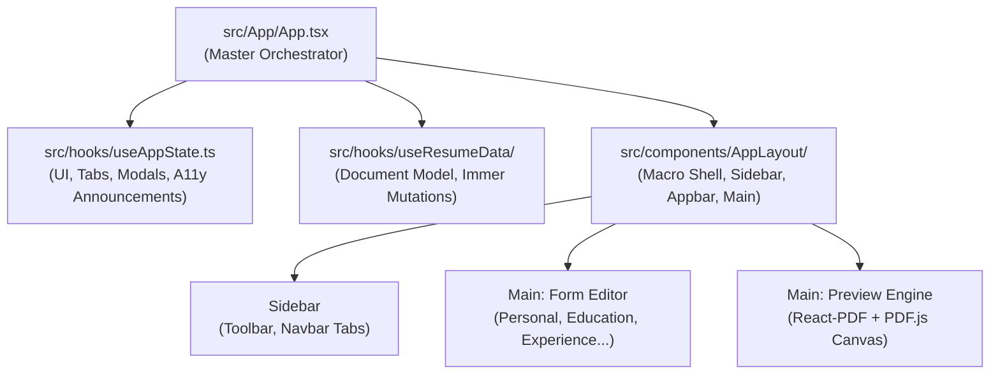

Resume Constructor is a production-grade, zero-bootstrap resume generator built on **React 19**, **TypeScript (strict)**, **SCSS with BEM**, custom **webpack 5** and the **Bun** runtime. It implements the formatting, typography and content standards defined in [The Tech Resume Inside Out](https://thetechresume.com/) book by Gergely Orosz.

The codebase is engineered around strict boundaries between presentation, form state, document rendering and accessibility infrastructure.



---

## Architectural Principles

### 1. Zero-Bootstrap Philosophy

The application avoids heavy UI component libraries (such as Material UI, Tailwind or Chakra). Every UI element — from buttons and modal dialogs to sortable lists and form controls — is built from first principles using semantic HTML, CSS custom properties, BEM methodology and WAI-ARIA authoring practices. This ensures:

- Zero styling abstraction leaks.
- Total control over DOM hierarchy and keyboard focus trapping.
- Minimal bundle footprint and instantaneous startup.

### 2. Component Colocation

Every UI component and page feature is self-contained in its own directory following a strict four-file colocation pattern:

```text
src/components/Button/
├── Button.tsx         # Component implementation and prop types
├── Button.scss        # Scoped BEM styles
├── Button.test.tsx    # Jest + React Testing Library suite
└── index.tsx          # Clean public barrel export
```

### 3. Deep Immutability Pattern (`ReadonlyExcept`)

Component prop interfaces enforce deep immutability across component boundaries using the custom `ReadonlyExcept` utility type:

```ts
import type { MouseEvent, ReactNode, RefCallback, RefObject } from 'react';

import type { ReadonlyExcept } from '@/types/ReadonlyExcept';

export interface ButtonProps {
  children: ReactNode;
  disabled?: boolean;
  onClick?: (event: MouseEvent<HTMLButtonElement>) => void;
  ref?: RefCallback<HTMLButtonElement> | RefObject<HTMLButtonElement | null>;
  variant?: 'icon' | 'primary' | 'secondary';
}

export function Button({
  children,
  ref,
  variant = 'primary',
  ...rest
}: ReadonlyExcept<ButtonProps, 'ref'>) {
  /**
   * Props are deeply immutable; ref remains accessible as a
   * first-class React 19 prop.
   */
  return (
    <button ref={ref} {...rest}>
      {children}
    </button>
  );
}
```

This prevents accidental prop mutation and enforces pure functional component contracts.

---

## State Management Architecture

State is decoupled into two primary custom hooks coordinated by `App.tsx`:

### 1. Document Data Model (`useResumeData`)

Manages the structured content of the resume (`Personal`, `Education`, `Experience`, `Projects`, `Skills`, `Certifications`, `Links`).

- Utilises `use-immer` to perform safe, deeply nested draft mutations.
- Provides atomic action creators (`updateName`, `addDegree`, `deleteJob`, `reorderSkills`) ensuring consumer components never manipulate state shape directly.
- Encapsulates bulk operations (`clearAll`, `fillAll`, `clearSection`).

### 2. UI & Interaction State (`useAppState`)

Manages ephemeral shell state:

- **Active Section IDs:** The ordered collection of enabled resume sections.
- **Current Tab:** The currently opened section in the editor.
- **Editor Mode:** Section management mode in the navbar (`editorMode`) enabling drag-and-drop section reordering and one-click section removal.
- **Modal Dialog States:** Visibility of "Add Sections", "Clear All" and "Fill All" popups.
- **Screen Reader Live Announcements:** Centralised `announcement` string rendered into an `aria-live="polite"` region.

### Zero Redundant Effects

In strict compliance with `eslint-plugin-react-you-might-not-need-an-effect`:

- No `useEffect` is used for state synchronisation or data transformation.
- Derived values (e.g. can a section be deleted, is the active tab still valid) are computed synchronously during render.
- Focus restoration and side effects are executed inside explicit user event callbacks.

---

## Directory Organisation

```text
resume-constructor/
├── docs/                     # Astro Starlight documentation portal
├── src/
│   ├── App/                  # Application shell and font initialisation
│   ├── assets/               # Static icons and graphic assets
│   ├── components/           # Reusable, domain-agnostic UI primitives
│   │   ├── AddSections/      # Section selection modal dialog
│   │   ├── AppbarIconButton/ # Responsive appbar action buttons
│   │   ├── AppLayout/        # Macro shell (Sidebar, Navbar, Toolbar, Main)
│   │   ├── BulletPoints/     # Dynamic sortable accomplishment lists
│   │   ├── Button/           # Base button primitive
│   │   ├── Popup/            # Modal dialog wrapper with focus trap
│   │   └── Preview/          # PDF rendering & canvas rasterization
│   ├── hooks/                # Custom React hooks (state, layout, a11y)
│   ├── pages/                # Feature form sections (Personal, Education...)
│   ├── styles/               # Global SCSS, custom properties, BEM base
│   ├── types/                # TypeScript domain interfaces and utility types
│   └── utils/                # Pure helper functions (capitalize, neverReached)
├── webpack.common.cjs        # Shared webpack 5 build configuration
├── webpack.dev.cjs           # Development server configuration
└── webpack.prod.cjs          # Production optimization pipeline
```
