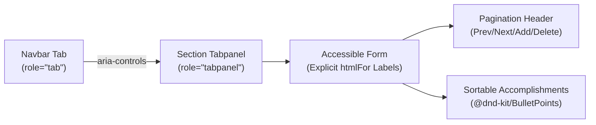

The editing interface of Resume Constructor is structured around seven domain sections, each mapped to a dedicated tabpanel in the application shell. Rather than relying on generic form wrappers, every page is custom-built to balance strict WCAG 2.2 AA accessibility, atomic state mutations via Immer and tactile keyboard operability.

---

## 1. Accessible Form Semantics

Every section component is bound to the sidebar navigation using explicit WAI-ARIA tabpanel contracts:

- **Tabpanel Binding:** The root element of each page is a `<section>` element marked with `role="tabpanel"`, `id="<sectionId>-tabpanel"` and `aria-labelledby="<sectionId>"`.
- **Explicit Label Coupling:** Under `jsx-a11y/label-has-associated-control`, implicit wrapping is strictly prohibited. Every `<input>` and `<textarea>` control is programmatically linked to an adjacent `<label>` through matching `id` and `htmlFor` attributes.
- **Natural DOM Source Order & Unassisted Tab Flow:** The shell and page DOM are
  laid out so that document source order strictly mirrors logical reading
  order: progressing from the `Sidebar`/`Navbar` tabs, through the active
  tabpanel in `<main>`, to individual form fields in linear succession. Because
  positive `tabIndex` values are never used, forward keyboard navigation (`Tab`)
  from the active navbar tab directly into the panel's first interactive control
  occurs 100% natively via browser heuristics without synthetic event listeners
  or manual focus redirection.
- **Surgical Reverse Focus Boundary Interception:** The only focus edge
  requiring programmatic intervention is the reverse direction. When navigating
  backwards via `Shift+Tab` from the first interactive control inside any
  tabpanel, `useLastComponentBeforeTabpanel` intercepts the event and returns
  focus directly to the controlling navbar tab button. This bridges the only gap
  in native document flow to preserve bidirectional keyboard symmetry.

---

## 2. Domain Data Structures

The editor manages seven discrete section schemas defined in `src/types/resumeData.ts`:

| Section            | Model Interface  | Primary Properties                                             | Key Dynamic Behaviours                                                  |
| ------------------ | ---------------- | -------------------------------------------------------------- | ----------------------------------------------------------------------- |
| **Personal**       | `Personal`       | `fullName`, `jobTitle`, `email`, `phone`, `address`, `summary` | Flat form with dedicated HTML input types (`email`, `tel`).             |
| **Education**      | `Education`      | `shownDegreeIndex`, `degrees: Degree[]`                        | Carousel card pagination, degree fields and nested bullet points.       |
| **Experience**     | `Experience`     | `shownJobIndex`, `jobs: Job[]`                                 | Carousel card pagination, job history fields and nested bullet points.  |
| **Projects**       | `Projects`       | `shownProjectIndex`, `projects: Project[]`                     | Carousel card pagination, code/demo repository links and bullet points. |
| **Skills**         | `Skills`         | `languages`, `frameworks`, `tools`                             | Three sequential accomplishment groups managed via `BulletPoints`.      |
| **Certifications** | `Certifications` | `certificates`, `skills`, `interests`                          | Multiline text areas capturing credentials and professional interests.  |
| **Links**          | `Links`          | `website`, `github`, `linkedin`, `telegram`                    | Paired link descriptors containing anchor text and target URL.          |

---

## 3. Dynamic Carousel Pagination

In multi-item sections (Education, Experience and Projects), items are presented using a focused carousel pattern rather than an endless vertical list:

1. **Card Navigation:** The currently active record is tracked by index (`shownDegreeIndex`, `shownJobIndex`, `shownProjectIndex`). "Show Previous" and "Show Next" buttons allow traversing items.
2. **Atomic Entity Creation:** When adding a new item (e.g. `addDegree()`), a fresh record is initialised with unique entity UUIDs generated via `crypto.randomUUID()`. The view automatically switches to the newly created entity and focus shifts to its first input.
3. **Safe Deletion & Index Recalculation:** Deletion buttons are disabled when only one item remains. When an active item is deleted, `getNextShownIndex` shifts focus to the adjacent sibling or decrements to the preceding item if deleting the tail.

---

## 4. Drag-and-Drop Architecture (`@dnd-kit`)

Accomplishment lists in jobs, degrees, projects and skills utilize `@dnd-kit/core` and `@dnd-kit/sortable` inside the reusable `BulletPoints` primitive:

- **Sensors:** Configured with `PointerSensor` (requiring a distance threshold before drag initiation to distinguish intentional drags from clicks) and `KeyboardSensor` (using `sortableKeyboardCoordinates`).
- **Modifiers:** Constrained with `restrictToVerticalAxis` and `restrictToParentElement` to keep draggable items within their visual bounds.
- **Aria Live Feedback:** Comprehensive announcement dictionaries provide dynamic screen reader feedback:
  - Drag start: `"Picked up draggable item X."`
  - Drag over: `"Draggable item X was moved over droppable area Y."`
  - Drop confirmation: `"Draggable item X was dropped over droppable area Y."`
  - Cancellation: `"Dragging was cancelled. Draggable item X was put to its initial position."`
