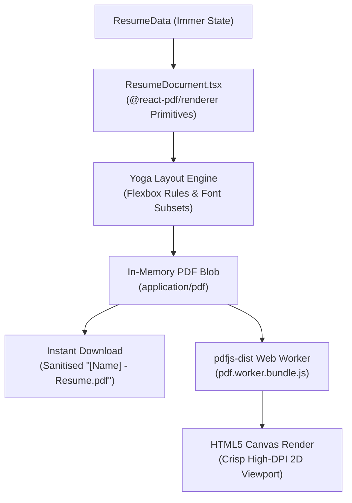

A central technical challenge in client-side resume generation is achieving exact visual parity between what the user sees in the browser and what is exported to the final PDF file. Standard browser printing (`window.print()`) suffers from variable browser margins, font rendering discrepancies and page break clipping.

Resume Constructor solves this problem through a dual-engine rendering pipeline:

1. **Compilation Engine:** `@react-pdf/renderer` declaratively constructs an A4 document according to strict Yoga Flexbox layout rules and generates an in-memory binary PDF `Blob`.
2. **Pre-Download Inspection Engine:** Mozilla's `pdfjs-dist` consumes the generated PDF buffer and rasterises the exact document pages onto an HTML5 `<canvas>` element inside an on-demand modal preview before downloading.

---

## 1. Declarative Document Construction

The exported document is defined in `src/components/Preview/ResumeDocument.tsx` and `ResumeSection.tsx` using `@react-pdf/renderer` primitive components (`Document`, `Page`, `View`, `Text`, `Link`, `Svg`, `Path`):

- **Physical Page Formatting:** The root `<Page size="A4">` enforces standard international A4 dimensions (595.28pt by 841.89pt, an aspect ratio of approximately 0.707).
- **Page Break Control:** Multi-line items (such as individual job entries or degree cards) are configured with `wrap={false}`. This directs the Yoga layout engine to prevent breaking an accomplishment block awkwardly across page boundaries.
- **Font Subsetting:** `src/App/loadFonts.ts` registers TTF font binaries (`Font.register({ family: 'EBGaramond', fonts: [...] })`) rather than WOFF. WOFF formats require runtime decompression in JavaScript (or fontkit), which introduced noticeable latency when compiling the PDF blob and rendering the preview modal or preparing downloads. Pre-registering raw TTF binaries eliminates this decompression overhead.

---

## 2. Yoga Layout Engine Constraints

Unlike standard web CSS, layout in `@react-pdf/renderer` is driven entirely by the Yoga layout engine. This imposes strict architectural constraints:

- **No CSS Grid or Floats:** All layout arrangements must be composed strictly using Flexbox (`flexDirection: 'row'`, `justifyContent: 'space-between'`, `alignItems: 'baseline'`).
- **No CSS Variables or Dynamic Functions:** CSS custom properties, `clamp()`, `calc()` and `first baseline` are unsupported in Yoga. All measurements must be resolved to static point (`pt`) or pixel values.
- **SVG Path Rendering:** Brand icons (GitHub, LinkedIn, Website, Telegram) are rendered using vector `<Svg viewBox="0 0 640 640">` with explicit `<Path>` definitions rather than external image files or CSS font glyphs.

---

## 3. On-Demand Modal Canvas Rasterization

The pre-download inspection modal in `src/components/Preview/Preview.tsx` visualises the real document compiled from `@react-pdf/renderer` without relying on inconsistent native browser PDF reader plug-ins:

> [!NOTE]
> This canvas rendering is strictly executed on demand when opening the preview modal before downloading. It is intentionally not dynamic during interactive typing: compiling `@react-pdf/renderer` documents into binary blobs and rasterising pages onto a `<canvas>` dynamically on every keystroke would be disastrous for performance. For real-time typing feedback, a lightweight pure-JSX DOM live preview is planned exclusively for larger displays where screen space allows (see [Roadmap](/guides/roadmap)).

1. **Worker Offloading:** PDF parsing and font decoding run off the main thread inside `pdfjs-dist/build/pdf.worker.mjs`, bundled via webpack 5 as an independent chunk (`pdf.worker.bundle.js`).
2. **Scale Factor Calculation:** The preview calculates the available container width inside the modal dialog and applies a high-DPI scaling factor (`scale: 2.0`) to guarantee razor-sharp typography on Retina displays.
3. **Race Condition Prevention:** When navigating between pages or re-rendering with updated data, in-flight render operations are cancelled via `renderTask.cancel()` to prevent outdated frames from overwriting newer renders.
4. **Window Resize Debouncing:** `useDebouncedWindowSize` debounces viewport adjustments by 1000ms (`DEBOUNCE_DELAY_MS = 1000`) before re-measuring canvas dimensions.

---

## 4. Headless Testing Parity (JSDOM)

Standard JSDOM environments do not implement the HTML5 Canvas 2D rendering context (`HTMLCanvasElement.prototype.getContext('2d')` returns `null`).

To maintain test execution speed without native binary canvas dependencies:

- In `jest.setup.tsx`, `pdfjs-dist/webpack` is comprehensively mocked.
- The mocked `render()` lifecycle returns a resolved promise without attempting to access raw 2D contexts, ensuring test suites execute in milliseconds while testing pure component lifecycle and prop propagation.
